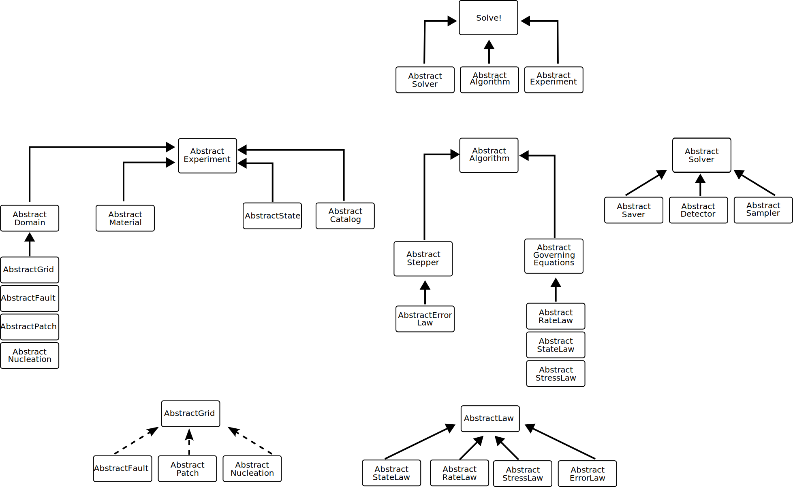

# Code structure and design
The package is designed to follow a composition based approach so that it is easier to customize the different solvers and problems but have a unified interface to solve/save/plot the results. The idea is to divide the different parts used in a simulation in independent components that can be swapped depending on what is necessary. In Julia these "components" are AbstractTypes, i.e. a general type that then can be used to define sub types or specific structs (concrete types). This is a simple UML class diagram that shows the general structure of the package and how the different components can be combined together. 




In general:

1. Experiments are defined as a combination of Domains and Material. Experiments also depend on AbstractState and AbstractCatalog (think of it as "i am measuring/recording the quantities during my experiment").
2. Algorithms are defined as a combination of Steppers and Governing equations
3. Solvers are defined as a combination of one or more AbstractSavers (what to save during a simulation), AbstractDetectors (is an event happening?) and AbstractSamplers (how does this quantity vary on this point/section?).

Solving is then just a loop that runs combinations of these three main components. 

```julia
function solve(experiment::AbstractExperiment, algorithm::AbstractAlgorithm, solver::AbstractTimeSolver)

    state = experiment.state
    stepper = algorithm.stepper
    dx = state.dx
    V  = state.V
    theta  = state.theta

    tf = solver.tf

    detector = solver.detector
    savers = solver.savers
    samplers = solver.samplers


    while stepper.time <= tf

        dx, V, theta = algorithm(dx, V, theta) #Find the next step using the algorithm

        sample(samplers, stepper, state, detector.eventN) # Sample 
        if typeof(detector) != EmptyDetector
            detect(detector, savers) # Detect (when an event is detected we save)
        else
            simsave(savers, stepper.step) # Save every nth step (if detectors are not used)
        end


    end

end
```


By using this approach then it is easy to expand. For example, if we want to add a fully elasto-dynamic solver for computing the stress then we just need to write the new component as a AbstractStressLaw and use that when defining the AbstractAlgorithm object.


# Available components


## Algorithms
```@docs
HighSeas.AbstractAlgorithm
```
```@docs
HighSeas.AbstractNewton
```


## Experiments

```@docs
HighSeas.AbstractExperiment
```
```@docs
HighSeas.AbstractBenchExperiment
```

## Geometries
```@docs
HighSeas.AbstractFault
```
```@docs
HighSeas.AbstractPatch
```
```@docs
HighSeas.AbstractNucleation
```

```@docs
HighSeas.AbstractDomain
```

## Grids
```@docs
HighSeas.AbstractGrid
```
```@docs
HighSeas.AbstractPowerGrid
```

## Laws
```@docs
HighSeas.AbstractLaw
```
```@docs
HighSeas.AbstractRateLaw
```
```@docs
HighSeas.AbstractStateLaw
```
```@docs
HighSeas.AbstractHybridRateLaw
```
```@docs
HighSeas.AbstractStressLaw
```
```@docs
HighSeas.AbstractErrorLaw
```

## Materials

```@docs
HighSeas.AbstractMaterial
```


## Solvers
```@docs
HighSeas.AbstractSolver
```

```@docs
HighSeas.AbstractStepSolver
```
```@docs
HighSeas.AbstractTimeSolver


## Steppers
```@docs
HighSeas.AbstractStepper
```
```@docs
HighSeas.AbstractAdaptiveStepper
```


```
